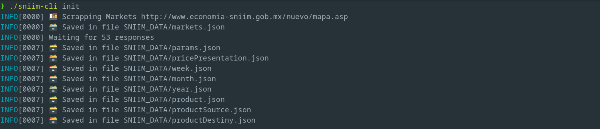
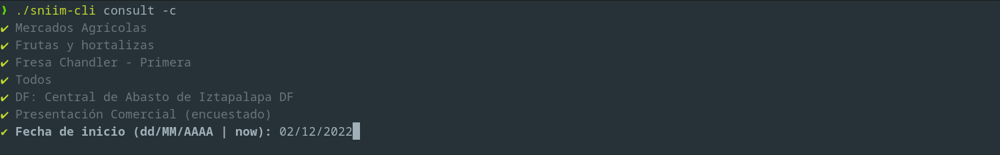
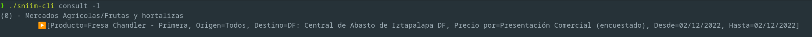
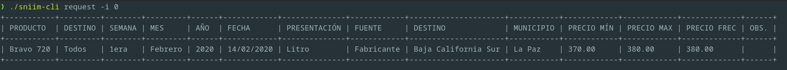

# SNIIM Scrapper

Scrapper para obtener los datos de precios sobre algunos productos como frutos y carnes en México.


## 📄 Variables de entorno

| Nombre | Descripción | Default |
|--|--|--|
| SNIIM_ADDR | Dirección del sitio fuente de la información | http://www.economia-sniim.gob.mx |
| CATALOGUE_SRC | Nombre de la base de datos o directorio del  filesystem para guardar los catálogos | SNIIM_DATA |
| DEBUG | Bandera para habilitar el modo debug | false |
| MONGO_URI* | Dirección de la base de datos mongo, solo se intentará conectar si está presente. | '' |


\* [TODO](./docs/README.md)
## 📦 Instalación

Para realizar una instalación de la herramienta puede visital la página de releases o bien descargar el código fuente y seguir los pasos de [compilación](./docs/Compilation.md).

## 🍇 Uso

Inicialización
---

El CLI necesita tener los catálogos disponibles para poder operar.

Para esto existe el comando init. 

🕹️ *Carga de catálogos.*

```bash
sniim-cli init
```


Registro de consultas
---

Para poder saber el precio de algún artículo, podemos crear una consulta. 

El comando **consult** con la bandera **-c** ó **--create** invocará una serie de preguntas basadas en la categoría y artículo seleccionados.

Si deseamos guardar esa consulta para volver a ejecutarla posteriormente, podemos agregar la bandera **-s** ó **--save**.

🕹️ *Crea un registro de consulta.*

```bash
sniim-cli consult -c
```


> 📝 Nota:  
*Al usar la palabra reservada **now**, estaremos indicando que la fecha de interés será la fecha en la que se ejecute la petición con el comando **request**.*

También podemos mostarr una lista de las consultas que tenemos guardadas en registros.

🕹️ *Listar las consultas registradas.*

```bash
sniim-cli consult -l
```



Ejecución de Consultas
---

Si deseamos repetir alguna de las consultas guardadas, podemos usar el comando request.

🕹️ *Realiza una consulta.*

```bash
sniim-cli request -i [índice]
```



> 📝 Nota:  
***-s** Es una bandera opcional que se puede agregar al comando de request para guardar en resultado obtenido en lugar de mostrarlo en la consola*